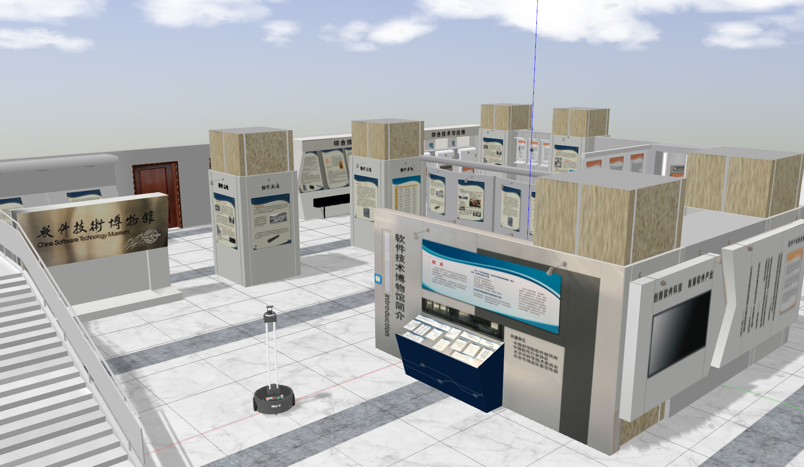

# xbot_sim

xbot_sim软件包，为Xbot机器人Gazebo仿真程序。

## 运行方法

确认`xbot_sim`已被编译, 执行以下命令启动仿真环境

```sh
$ roslaunch xbot_sim robot_spawn.launch
```
初次启动Gazebo需要几分钟的加载时间，Gazebo会从服务器上下载材质。

你将看到以下内容：软件博物馆场景和Xbot-U机器人。


你可以启动速度控制程序，用键盘控制机器人移动

```sh
$ rosrun xbot_sim robot_keyboard_teleop.py
```

## 注意事项
确认升级Gazebo到**7.0及以上版本**

查看Gazebo版本方法：

```sh
$ gazebo -v
```

如果版本低于7.0，请升级Gazebo：

```sh
$ sudo sh -c 'echo "deb http://packages.osrfoundation.org/gazebo/ubuntu-stable `lsb_release -cs` main" > /etc/apt/sources.list.d/gazebo-stable.list'
$ wget http://packages.osrfoundation.org/gazebo.key -O - | sudo apt-key add -
$ sudo apt-get update
$ sudo apt-get install gazebo7
```
